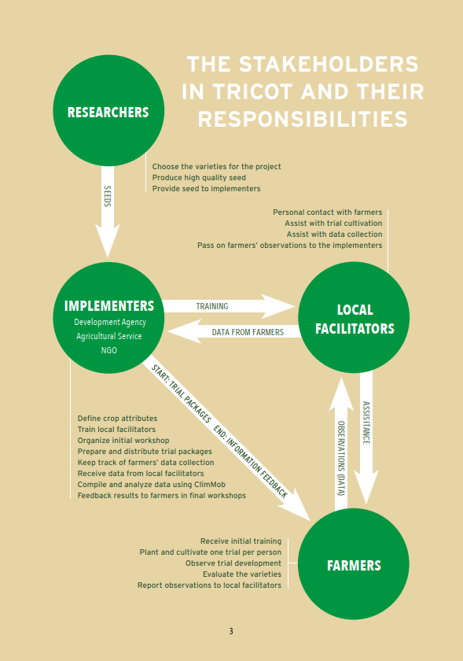

# Introduction to the tricot approach 

> Jacob van Etten, Jonathan Steinke, Kauê de Sousa

Tricot (triadic comparisons of technologies, pronounced “try-cot”) is a citizen science approach for testing technology options in their use environments, originally conceived in 2011 (van Etten 2011). The Oxford English Dictionary defines citizen science as “the collection and analysis of data relating to the natural world by members of the general public, typically as part of a collaborative project with professional scientists”. Different definitions are given by others, but our use of it is not far from this one. As a citizen science approach, tricot actively involves non-scientists in experimental data generation and interpretation. This follows a broader movement of applying citizen science and crowdsourcing methods in research on food and agriculture, providing a fresh lease of life to participatory agricultural research (van de Gevel et al., 2020; Ryan et al., 2018; Minet et al., 2017).  

Tricot addresses important challenges that have plagued on-farm testing, which is an often-underrated activity in the agricultural sciences (Kool, Andersson, and Giller, 2020). Also, the approach is increasingly used for areas closely related to on-farm testing of varieties, such as fertilizer testing (AKILIMO scaling project by IITA and CIP in Rwanda) and food product testing for sweetpotato implemented by CIP (Moyo et al., 2020, 2021). Testing technologies in their use environments is important for external validity of experiments, the degree to which the findings have application outside of the experimental setting. To overcome common issues in user testing, the tricot approach streamlines the approach through digital support throughout the experimental cycle, simplifies the experimentation format to make user participation easy, and enhances data analysis by enriching it with data about the user context. 

The method was first implemented and tested in the period between 2013 and 2016 for on-farm testing of varieties, and an earlier article reported about methodological progress in this period (van Etten et al., 2019). Much of this work was part of the Seeds for Needs initiative, aiming at broadening the range of varietal diversity to farmers to adapt to climate change (Fadda et al., 2020). These projects were focused on cereals and grain legumes. Since then, the tricot approach has been used for other trials, by different organizations (including private sector) and for different applications (food products, fertilizers, etc.), and for clonal crops (cassava, sweetpotato, potato), vegetables, and a perennial crop (cocoa). The present article reports on 1) methodological progress; 2) discusses important considerations that implementers of the tricot approach need to consider; and 3) areas open for future research. 

# Description of the tricot approach 

The tricot approach has been described in several publications (van Etten et al., 2019; van Etten, 2011; van Etten et al., 2020; Steinke et al., 2017; van Etten et al., 2019; Fadda et al., 2020; Beza et al., 2017). Here, a short synthesis will be provided.  

The word ‘tricot’ is derived from triadic comparisons of technology options. ‘Triadic’ refers to the sets of three technology options that are compared by each participant. Tricot enables many citizen scientists doing a small experiment while contributing to answering a larger question. Researchers and citizen science participants are supported throughout the experiment cycle by digital tools to design, execute, monitor and analyze the trials. As many citizen scientists contribute and do experiments in their typical use environments using their usual practices, it becomes possible to start to understand how variation in environments and practices affects the results. 

The particular way in which tricot works makes these steps possible. The following aspects are key to tricot:  
1. the use of incomplete blocks of three items – to make the threshold of participation low in terms of farm size, and reduce resource needs and training required; 
2. the use of ranking as the main way to report observations -- to facilitate digital data collection and to make it possible to evaluate a tricot plot with very little training (in contrast, scoring requires calibration and absolute yield measurements require training);  
3. the limited control of experimental conditions – following common local technology use practices to maximize external validity; 
4. the use of a streamlined digital process from trial design to analysis – to make it manageable, executable with many participants, to reduce errors, to reduce costs, and to quickly deliver feedback to achieve high motivation and impact on subsequent decisions; 
5. early feedback of the results to the participants -- to provide ownership to and stimulate engagement of participating “citizen scientists” and to validate results. 

Tricot builds on existing participatory research formats that have been used in the past, as documented by (Van Etten et al., 2019). The novelty of the format is the combination of the different elements in a standardized, widely used approach supported by a corresponding digital platform, ClimMob (https://climmob.net). 

Another innovation behind the tricot approach is the use of the Plackett-Luce model (Luce, 1959; Plackett, 1975). This statistical model is also not new, but an appropriate software implementation was not available. In previous analyses of on-farm data, data were converted to pairwise comparisons, after which the Bradley-Terry model was used (Coe, 2002; van Etten et al., 2019; Steinke et al., 2019; Dittrich et al., 2000). However, this leads to anti-conservative statistical error estimates and the conversion from rankings to pairwise comparisons implies information loss. This was the reason to implement the Plackett-Luce model in R (Turner et al., 2020). Also, a number of other R packages were created to support data management and analysis. These are described in section 12 below. 

The approach is supported by the ClimMob digital platform (https://ClimMob.net). The platform will be described in detail in a forthcoming paper (Quirós et al., forthcoming). It supports the user in designing a trial, randomizing the entries, creating electronic questionnaires, collecting the data, monitoring trial progress, and generating reports. 

There are several other elements that support the users. The different steps of the tricot approach are described in a manual (van Etten et al., 2020). Also, there are online guides and videos available from https://climMob.net.

# How is the tricot approach is used?

The tricot approach (triadic comparison of technology options) is a participatory method designed for product use testing in agriculture. It has been applied in on-farm trials, consumer testing, concept evaluation, and iterative product development. The approach leverages citizen science to generate robust, scalable insights across diverse environments and user contexts. Here's how it integrates into different aspects of product use testing:

1. On-Farm Testing

Farmers receive three randomly assigned technology options (e.g., seed varieties, fertilizers) and independently evaluate their performance under local conditions. No direct supervision is required, making it cost-effective and scalable, especially in remote areas. Data collection focuses on farmer-reported outcomes such as yield, resilience, and preference, linked to environmental metadata (e.g., soil, climate), socio-economic metadata (e.g., market preferences, household dynamics, management practices) and DNA metadata.

2. Consumer Testing

Tricot integrates consumer preferences for end-use products (e.g., taste, cooking quality, shelf life). Farmers and end-users assess outputs from tested options (e.g., crops, processed goods) to ensure alignment with market demands. The approach helps bridge the gap between agricultural production and consumer needs by combining field performance with end-user satisfaction.

3. Concept Testing

Tricot can be used to evaluate broader concepts, such as innovative farming practices, new varieties and agroforestry designs. Participants compare three alternatives in usability, practicality, or benefits, ensuring the development of context-specific solutions. This iterative testing phase supports refining ideas before large-scale implementation.

4. Farmer-Centric Data and Decision Support

By empowering farmers as co-researchers, tricot generates farmer-driven data, enriching breeding programs and product development pipelines. Insights into environmental interactions and user preferences guide demand-driven breeding and agricultural innovation. The [ClimMob](https://climmob.net/) Platform enable real-time data collection, analysis, and visualization to inform decision-making.

5. Scaling and Adaptation

Tricot's simplicity allows broad implementation across geographies, crops, and technologies. The model is adaptable to low-resource settings, supporting smallholders while enabling private sector product testing. It also fosters inclusivity, involving women, youth, and marginalized groups in the innovation process.

6. Outcomes and Impact

Enhances crop diversity and resilience by tailoring recommendations to local needs. Increases adoption rates by aligning product characteristics with farmer and consumer preferences. Supports sustainable and climate-adaptive agriculture by integrating real-world testing with robust scientific analysis. In summary, the tricot approach is a dynamic, end-to-end solution for product use testing in agriculture, integrating farmer trials, consumer insights, and conceptual testing. It drives innovation by prioritizing user needs, ensuring product relevance, and enabling resilient and inclusive agricultural systems.

# How the tricot approach works 

With the tricot method, large numbers of farmers carry out many small, simple trials on their own farms instead of a few big, complex trials conducted at research stations. A research center provides the participating farmers with material for the on-farm trials. The farmers 
provide observations from their trials to the ag-ricultural research center, where the data from all mini-trials is aggregated and analyzed. The 
research center then feeds back the findings to the farmers.

With tricot, research centers can validate and disseminate new agricultural technologies in a participatory way, collaborating with a large number of farmers under diverse conditions. Large-scale tricot experiments, involving many farmers, generate excellent/reliable results about the performance of different technology options (such as different crop varieties or different fertilizer types) in different environments. Farmers evaluate the new technology options on their own farms and under real conditions. 

The tricot trial format is very simple for participating farmers: each executes the mini-task of evaluating only three technology options, out of 
a range to be tested. This makes it possible to engage many farmers without expending excessive effort on training or supervising them. But this does not mean we can only evaluate three technology options at once! Even though each farmer only evaluates three options, they evaluate many different combinations of technology options, that partially overlaps with the combination of other farmers. By putting the results of their experiments together, a tricot trial can evaluate how well each the options performs relative to the others. Tricot is like a world sports ranking. These rankings cover all players (or teams) and reflect their relative strength. The scores depend on the matches the players have won from other players. But these calculations can be done even if certain teams never played against each other. 

Tricot is a valid strategy to overcome the ‘bottleneck’ of technology dissemination to users,often faced by research institutes, because it 
presents the following advantages:

• Farmer-led innovation 
Being fully executed by farmers on their farm, tricot experiments account for important adoption criteria that could easily not 
occur in researcher-managed trials.  

• Specific solutions 
Rural households benefit directly and firsthand from discovering new technology options that fit their environmental and socio-economic conditions, with a high probability of improving their farm production.  

• Capturing diversity 
Tricot experiments address the challenge of diversity in regions where environmental conditions or socio-cultural preferences vary strongly across the landscape. The tricot approach helps research centers to collaborate with farmer organizations, development organizations or input providers in the organization of large trials with many farmers.  

• Meaningful data 
Tricot uses a data-driven approach that can combine farmer-generated experimental and preference data with data about cropping systems and farming households, thus it enables a rich analysis. Without tricot, this could only be achieved by very complex methods (such as crop modelling). The tricot data can be analyzed with existing maps of temperature, rainfall, altitude, and other environmental variables. These analyses can provide recommendations for different environments or strategies to deal with climatic risk. Tricot makes it possible to combine several seasons of data to do in-depth analyses of this kind.

