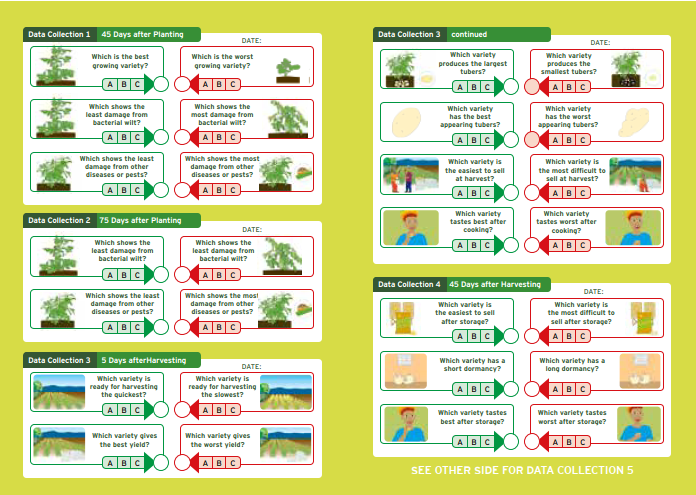

# Planning a tricot experiment

> Béla Teeken, Gospel Edughaen, Kauê de Sousa, Rachel Chase

## Problem Identification
- Defining research questions and objectives.
- Understanding the target farming system.

## Stakeholder Engagement
- Roles of researchers, extension agents, local facilitators, and farmers.
- Building partnerships (e.g., with NGOs, genebanks, seed companies).

## Resources and Budgeting
- Required materials (e.g., seeds, observation tools, digital platforms).
- Time and financial planning.

From Planning (short guide)

Whether or not the tricot method is suitable for your project should be based on knowledge of local farming. Tricot is a methodology for introducing agronomic innovation. It is most useful in situations where farmers are experiencing agronomic challenges or where they are dissatisfied with product quality of their harvests. Tricot should only be used when it is believed that agronomic innovation can be part of the solution.

A thorough problem analysis must first be done. By discussing with experienced field agents and members of your target group about their needs and aspirations, you should ask: Is there a pressing problem that can be solved through agronomic innovation? If yes, Which technology should be considered (for example: crop varieties, irrigation technologies, fertilizer dosage, tillage systems)? 

Which technologies will be tested? 

Researchers should be considering and proposing technologies that have the potential to solve local problems and can be easily adopted by farmers. The more you know about the agronomic problems experienced by the target group, the more precisely you can select the technology options. As a start, a total number of 8-12 technology options is recommended. A good way to select these from an even larger pool is by conducting focus group discussions with a core group of local farmers from diverse locations.

In which area will the project be conducted?

For practical reasons, it is best to work in a defined region. If the project is spread across an entire country it can be hard to stay in touch with the local field agents and to assemble farmers for the initial training.

How many farmers will participate?
It advisable to involve as many farmers as possible. The larger the number of trials evaluated, the more useful the information about the technology options becomes. Bear in mind that involving more farmers will also take more work to assist farmers in completing the process. Avoid including more farmers than the local field agents can assist. Each field agent may be responsible for up to 25 farmers. When starting a project and gaining experience with the methodology, it is advisable to include around 100 to 200 farmers, which is enough to obtain good results in most situations. In
future iterations, the tricot experiment can be scaled up to involve more farmers.

Who should participate?

It is important to think about the selection of farmers, who should be representative of the broader group of potential users of the technological options. Think about age and gender aspects, but also about different uses that can be given to the technology in different contexts. For example, technology needs can be very different between a household that produces for its own consumption and another that produces for the market. Also, different users may perform different tasks in relation to the technology and may therefore have different knowledge about it. For example, in 
the case of crop varieties, it can be relevant to include processors and consumers. Decisions on the groups to include in the trial will influence you planning the recruitment (see Step 3).

Which criteria will be evaluated?

Maybe one technology option provides higher yields, but another one is less labor-intensive. Both criteria can be important, and there may be many more aspects that matter. You will need to define the criteria to be evaluated by the farmer-researchers. These can be defined by consultation with experienced field agents and local future users of the new technologies, both women and men of all ages. Many criteria can be evaluated, but it is recommended to pick no more than ten criteria. With more criteria, farmers may be discouraged by the complexity of observation. The key question must be: What really matters to the farmers? Most importantly, farmers should be asked to give their opinion about the overall performance of their technology options. Also, they should be asked why they prefer the best option. This is an open question and it is therefore possibe that farmers mention criteria that had not been considered beforehand.

How will data be collected?

Tricot uses the Open Data Kit (ODK) Collect app as the main way to collect data. The ODK Collect app is available free of charge on Google Play Store and can be installed on any Android smartphone or tablet. It allows implementers to register participating farmers, and field agents can collect farmers’ observation data for each of the criteria. When field agents gather the data collected by farmers in the field, the data will be stored on the device until an internet connection is available. All data is then sent to the ClimMob server for storage and analysis. During different steps of
the project, ODK forms will be automatically generated by the ClimMob software or will be available on the ClimMob website for download. Other data collection methods can be made available (interactive voice response, Whatsapp). Contact the ClimMob team (climmob.net) for more information.

What do you need to know about the participating farmers?

Tricot research can be used to evaluate how farmers’ adoption preferences for different technology options differ by region, gender, wealth status, or other farmer-specific variables. Understanding these differences can help to generalize by category the results from the experiment and to tailor technology recommendations for further households. Project implementers should define variables they consider important, so these can be collected from the farmer-researchers. Project implementers can formulate their own questions or they can use questions from the ‘Rural Household ulti-Indicator Survey’ (RHoMIS) to gather key household information. RHoMIS is free for download on the ClimMob platform.

Should participation be rewarded?

This question requires careful thought. Providing a reward to motivate farmers could increase participation. But some types of rewards can undermine enthusiasm, curiosity, and the desire to learn, which are often the most important reasons for participation. In several tricot projects, farmers received extra seed of the variety they preferred. This kind of reward is closely tied to the goal of the project and motivates farmers not only to contribute, but also to pay attention to the process, andto be sure to pick a good technology option for their farm.

Which visual materials are needed?

At www.climmob.net you will find examples and illustrations to help you generate your own visual materials. In order to explain the process to your tricot farmers and to facilitate the data collection, the following materials can support you:

• Informative leaflet or poster, as an aid to explain the tricot process to the farmers.
• Observation card, for the farmers to collect their observations on the field. It is designed to enable participation with a minimal level of literacy. 

SCALING: COST REDUCTION AND NEW BUSINESS MODELS (RTB) - not sure if this goes on this page?

An important benefit of tricot is the possible reduction of trial costs, which could drive its adoption across different organizations, apart from the improved insights that it produces. Precise cost comparisons are difficult as there is no gold standard to compare with. Both ‘conventional’ participatory variety selection and tricot can be implemented in different ways. If both are implemented in a very intensive way (organizing farmer groups, meetings, working with RTB seed materials), the cost reduction is estimated to be roughly 40%. At the other extreme, a tenfold cost reduction is possible in the US, where farmers receive seeds by mail and are connected by smartphones. One reason for cost reduction is that some costs are externalized to farmers who volunteer to execute mini-trials using their own labor, land and inputs. This raises the question whether farmers’ motivation to participate is sufficiently enhanced by tricot to justify this investment. Previous studies showed that farmers’
motivation to participate in tricot is mainly related to access to seeds and information (Beza et al., 2017). Cost and motivation analyses are underway and should be available for Rwanda and Ghana in 2021. 

Further cost reductions are possible if farmer networks are maintained over time, if they are serviced through channels that are also used for other means (credit provision, for example), and if they can reach economies of scale by testing varieties and other options for multiple crops. Tricot would make it possible for breeders and agronomists to ‘outsource’ trials to farmer-facing organizations. Alternative business models have already been introduced in the US context by organizations such as the Farmer Business Network, FIRST (Farmers’ Independent Research of Seed Technologies), and SeedLinked. The latter uses the tricot approach for its trials. The Alliance of Bioversity International and CIAT is exploring alternative business models following this trend focusing on the global South. Research is ongoing within RTB to determine the best scaling strategies for Rwanda and Ghana. 