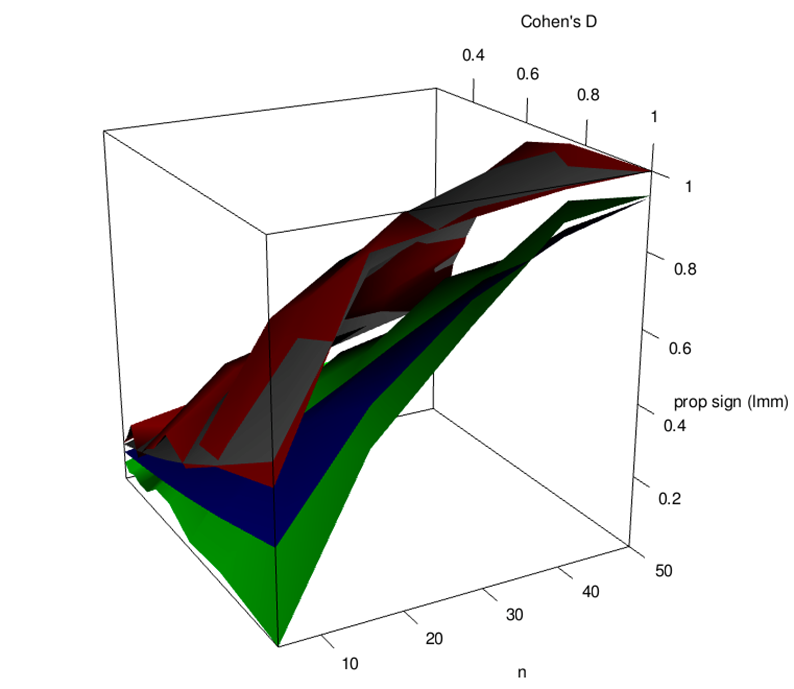
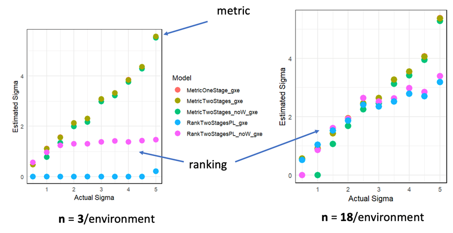
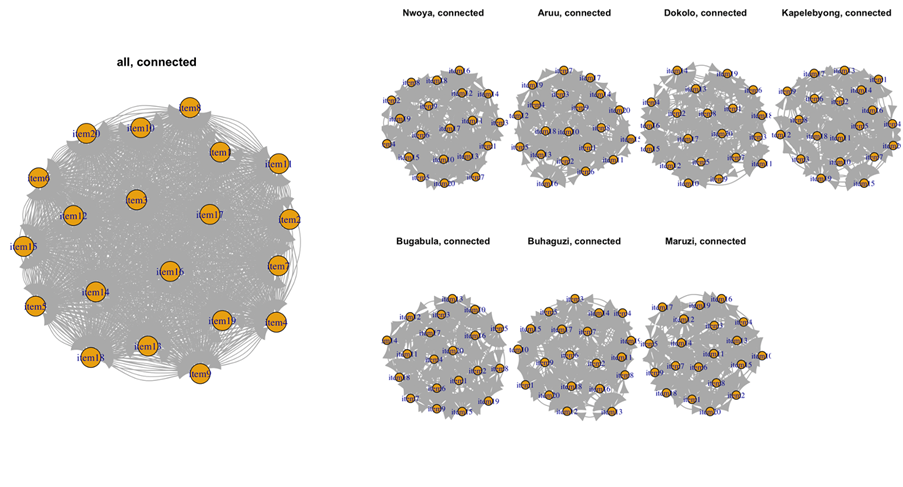
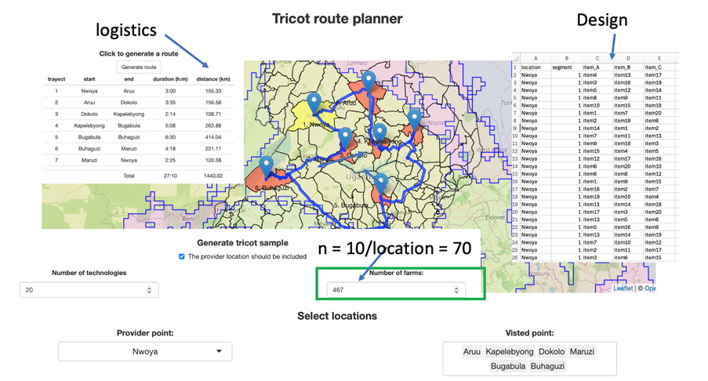

# Geographic sampling

## Sample size

As for any experiment, deciding on appropriate sample size is important when designing tricot trials. Since determining genotypic differences in performance is the aim of variety trials, the number of replicates per genotype (n) determines statistical power. As can be seen in figure 1., statistical power increases with n, and a quite substantial number of replicates may be required when differences between varieties are small, or residual (i.e. random) variation is large. 
For example, detecting a difference in average (measured) yield equal to the residual standard deviation (i.e. a so-called Cohen’s D of 1) with 80% probability would require approximately 20 replicates per genotype. It is important to note that tricot ranking data contains less information than direct measurements and, consequently, about twice as many replicates are needed to achieve equivalent power (i.e. an n of 40 for a power of 80% in the mentioned case). Also, rank-based estimates of genotypic performance may be unreliable when n is too small and a minimum of 20 replicates should be aimed for.
Tricot trials are designed to be fully balanced, so once the number of replicates, n, and the number of genotypes, ngenotypes, is decided, it is straightforward to calculate the required resources. The following equations are helpful in this regard.

To calculate the number of plots required:

Nplots = nfarms × 3 = ngenotypes × n

To calculate the number of farms required:

nfarms = (ngenotypes × n)/3

To calculate the sample size, n, for an existing design:

n = (nfarms × 3)/ ngenotypes 

## Geographic sampling

Tricot trials often cover different geographical or agroecological areas. In such cases, the most important aspects are sample size, balance, representativity. As mentioned above, rank-based genotype performance estimates may be quite unreliable when n < 20. This also applies when differential performance across geographies needs to be estimated (Figure 2) so it is recommended to strive for at least 10-20 replicates per geographical area. For multiple environments, balanced data implies that pairs of genotypes are compared the same number of times in each environment. This can be achieved by using a resolvable incomplete block (alpha) design, that can be generated by specialised software packages but in practice, the standard designs produced by ClimMob will be highly balanced if the same number of farms are assigned to different locations (Figure 3.). 
Finally, achieving good representation of geographical areas requires sampling multiple locations within the target region. A prototype sampling tool has been developed to aid in creating designs and itineraries for such multi-locational experiments (Figure 4). Logistically, it is convenient to sample multiple farmers per location and to allow detection of location specific effects it is recommended to have at least 10 replicates per location. In the example with 20 genotypes and 7 locations shown in figure 4. this would require visiting 467 farms in total (67 farms per location). An appropriate balance between coverage of target areas and logistical cost is important, which is why the sampling tool will calculate total travel time for the shortest routes between chosen locations. 

Figure 1. Simulated statistical power to detect a difference between two genotypes (prop sign), as function of sample size (n) and magnitude of difference (Cohen’s D) for a quantitative trait (red) and for ranking data (red). The grey and blue planes indicate the expected values, assuming ranking data has an effective sample size of half compared to quantitative data.

Figure 2. Simulated results demonstrating the effect of sample size on the ability to estimate variation due to genotype by environment interaction (sigma) using continuous (metric) and ranking data for 3 and 18 replicates per environment (10 environments).  

Figure 3. Network graphs showing connectivity and balance in pairwise comparisons for aggerated (left) and desegregated (right) multi-location data.

Figure 4. Overview of output of the sampling tool prototype showing the most efficient route among locations covering a an agro-ecological zone. 
