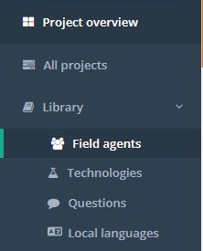
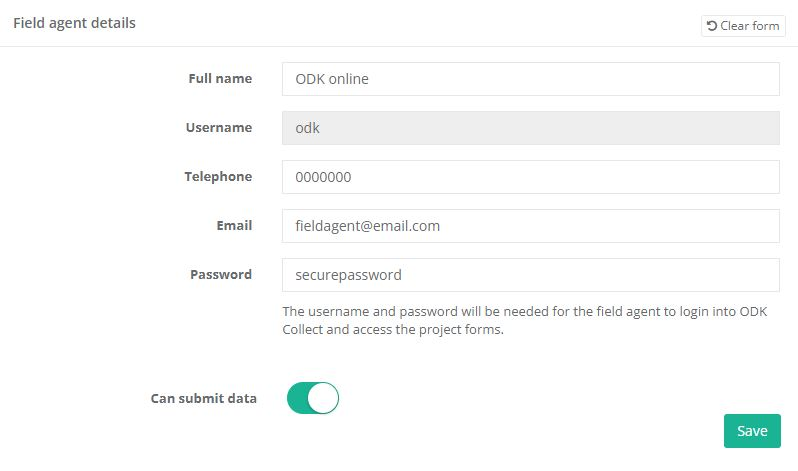
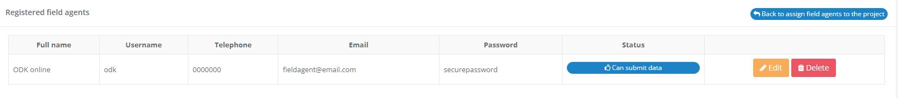
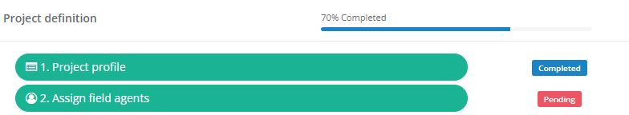
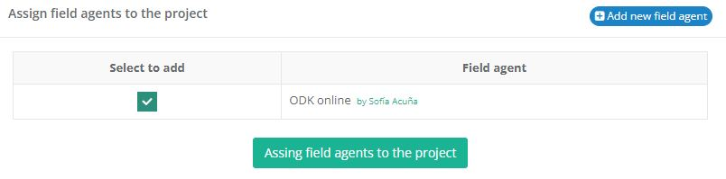
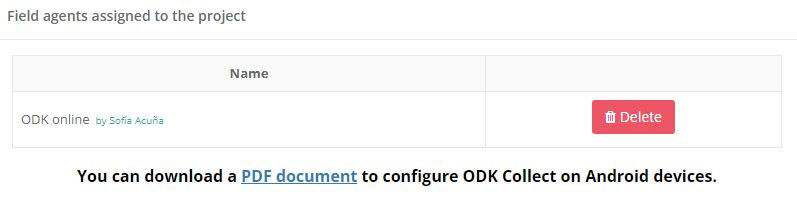
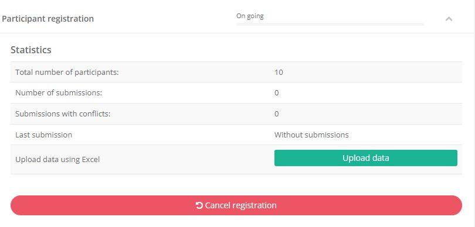
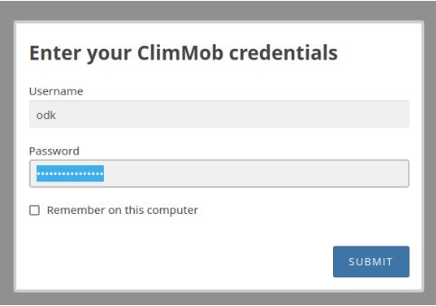
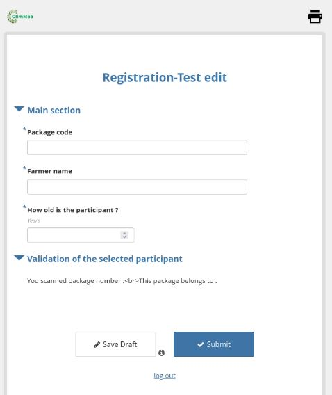

### 6. Technology randomization

After setting up your data collection moments and their corresponding questions, the next step is to create test packages through technology randomization. This process ensures that each participant receives a balanced set of technology options for evaluation.

How-to:

1.	On the project overview section (right side of the screen), click Generate packages with technology options to open the participant registration form.

2.	Set combinations:

*	Choose whether to include all technology options or only a selection.

*	Define how many packages with each technology option will be generated.

*	By default, all technology options are included, and the same number of packages are created for each.

*	**WARNING** If you change the number of packages for one technology, you must balance the total by adding or subtracting from others to ensure the same overall number of packages.

3.	Review packages and CONFIRM. If the list of packages is not confirmed, it will be lost, and you will need to repeat the randomization.

4.	Once confirmed, the randomization documents are available in the Downloads section:

*	List of packages with QR codes for the registration form → required for preparing test packages.

*	List with randomized trial packages (Excel) → shows the technology combinations assigned to each package. This file is useful when preparing test packages. **Do not edit this file**.

**Video tutorials:**

Set up the randomization for the ClimMob project

[Project setup - Registration form and Technology randomization](https://youtu.be/NcZ1pRWoO-0?si=017G7i3Wgq6p9ZIF)

Explanation of the generated documents after the randomization (downloads)

[Project setup - Registration files](https://www.youtube.com/watch?v=u_yxJachg10)

### 7. Prepare observation cards

In this step, you define and manage the questions that participants will answer during their tricot trial about the performance of their assigned technology options. These are always comparison questions, allowing participants to rank their field observations. The finalized questions will be printed on the observation cards that are handed out to participants.

How-to (two steps):

1. Define time points

Decide when participants should make their observations during the trial.

Example: For a bean variety test, you might ask participants to observe at three stages:

*	Day of sowing (start of the project).
*	30 days after sowing (mid-point).
*	Day of harvest (end of the trial).

2. Define observations

Based on the technology options being tested, determine which specific observations participants should make.

Each observation corresponds to one question on the observation card.

Example:

*	Plant height → “Which variety grows tallest?”
*	Stress tolerance → “Which variety looks healthiest?”

### 8. Prepare test packages

Once your technologies have been randomized, the next step is to create the physical packages that participants will use for the blind testing.

How-to (three steps):

1.	Gather materials

*	Collect enough of each technology option that you are testing.

*	Example: If you are testing seed varieties, gather sufficient quantities of each seed type.

2. Download package lists from ClimMob (in the Downloads section):

*	Randomized trial packages list → shows which combination of three technology options goes into each package.

*	Package list with QR codes for participant registration → contains the package number and its unique QR code.

3.	Prepare and label the packages

*	Assemble each package with its assigned set of three technology options.

*	Cut out the corresponding label (from the package list with QR codes).

*	Stick the label with the package number and QR code on the package before distributing it to participants.

### 9. Connect ClimMob with ODK Collect

To collect project data in an efficient and user-friendly way, you can link your ClimMob project with ODK Collect.

To install [ODK Collect](https://play.google.com/store/apps/details?id=org.odk.collect.android) on your **Android** device, go to the Google Play Store.

How-to (four steps):

1.	Install ODK Collect

*	Each field agent downloads and installs ODK Collect on their Android phone or tablet.

*	Note: ODK Collect is only available for **Android devices**.

2.	Obtain field agent QR codes from ClimMob

*	Once your field agents are registered in the platform, download the file “List with field agents and their QR codes to configure ODK Collect” from the Downloads section.

3.	Configure ODK Collect

Each field agent opens ODK Collect, taps the three-dot menu (upper-right corner), and selects “Configure via QR code”.

*	They scan their assigned QR code from the ClimMob list.

*	Note: The app may request permission to use the phone camera — allow access to complete the setup.

4.	Access and open the forms

*	In ODK Collect, tap “Get Blank Form”.

*	The project’s data collection form will download and be ready to use.

Video tutorial:

Connecting ClimMob to ODK collect 

[Link ClimMob with ODK Collect, part 1](https://www.youtube.com/watch?v=mm80jUSKvKU)

### 10. Register participants and distribute packages

Once you have prepared the packages with the different technology options, it is time to go to the field to distribute them and register each participant with their corresponding trial package.

How-to:

There are different ways to do this: you can arrange a meeting with all participants or visit them individually at their location.

**Using ODK Collect**

1.	Open ODK Collect and get the blank registration form.

2.	Fill in the form with participant data. The first step is to scan the QR code attached to the package with the three technology options the participant is receiving. This links the package to their individual profile.

3.	Once the forms are completed, send them to the server.

**Paper** (NOT RECOMMENDED, as it takes significantly more time and is more prone to errors):

1.	Alternatively, you can register participants using paper forms. These are available under Downloads → Printer-friendly registration form.

2.	Enter the data into an Excel file. On the main menu (left side), click on Upload data (green button) → Create template. The template will be generated and available in Downloads → Excel template for uploading registration form data.

3.	Once you have filled in the template, go back to the main menu, click on Upload data (green button, left side), and upload the Excel document.

Review, edit and complete registration:

●	Click on the green button View data to review the submitted data and edit if necessary.

●	Click on the red button, Finish registration once you have registered all participants.

⚠️ **Please note:** This step cannot be undone, so only proceed when you are certain that registration is complete.

Video tutorials: 

To know more, you can watch the video below from minute 1.58 on: 

[Link ClimMob with ODK Collect, part 1](https://www.youtube.com/watch?v=mm80jUSKvKU)

You can also watch this second video (from the beginning until minute 2:17):

[Link ClimMob with ODK Collect, part 2](https://www.youtube.com/watch?v=hzkjGnyQ_Jc)

### 11. Start an assessment 

Once participants have been registered and packages have been distributed, the on-farm trials can begin, and data collection (assessment) takes place.

How-to:

Data can be collected in different ways and at different time frames, depending on the project managers’ preferences:

●	If participants have observation cards, their trial data can be collected at the end of the planting cycle.

●	If participants do not have observation cards, field agents should visit them at each data collection point to record their observations.

Field agents can collect data in two ways:

1.	Using ODK Collect (recommended).

2.	Uploading data to the ClimMob platform through an Excel file.

On the ClimMob platform:

1.	Once all participants are registered, go to the project overview section (bottom left side).

2.	From the drop-down menu, select the data collection moment you want to assess and click Start assessment.

3.	Upload the data for that specific data collection moment. (Learn more about data uploading in the next step!)

4.	When finished, move on to the next data collection moment.

### 12. Trial data collection

Once farmers have started their on-farm trials, the next step is to collect the data generated at the different data collection moments. For each moment, ClimMob generates a specific form with tailored questions. Data can be collected using ODK Collect (recommended) or, alternatively, by uploading an Excel file to the ClimMob platform.

Using ODK Collect (recommended)

1.	Each field agent opens ODK Collect on their phone.

2.	Tap the three dots (top-right) → Get blank form → select the data collection form.

3.	For the first data collection moment:

*	Choose Fill blank form.

*	Select the participant.

*	Enter the data.

*	Send the finalized form.

4.	Back in the ClimMob platform, the project administrator must:

*	Check the collected data and correct if necessary (from the main dashboard, click View data on the right side and select the parameters to review).

*	Once verified, go to the main menu, finish the first data collection, and start the next assessment.

5.	Repeat this process until all data collection points are completed.

Actions in ODK Collect:

●	Cancel form: Permanently deletes the form. No further data can be collected, and any existing data will also be deleted.
Using Excel (not recommended)

1.	In the ClimMob dashboard, go to the main menu (left side) and click Upload data (green button).

2.	Click Create template. The Excel template will be generated and saved in your Downloads as Excel template for uploading assessment form data.

3.	Fill in the template with the collected data.

4.	Return to the ClimMob main menu → Upload data (green button) → upload the completed Excel file.

**Submit data from a browser**

To fill out forms online supported by Enketo, the field agents (enumerators) need to log in using their credentials (username and password). Here we do a quick explanation on how to register a new field agent, that subsequently will login to Enketo to submit data from a browser.

Visit the Field Agents section in the main menu:

---

Fill in the form with the credentials of the field agent.
 

---

Verify that the field agent has been successfully created in the list of registered field agents:

 

---

In the project definition, select “Assign field agents”:

 
---

Select the field agent(s):

 

---

Click on the “Add field agents” button and verify that the user has been assigned to the project.

 
---

In the main menu, visit the form you wish to fill out using the browser and click on the “Submit data from a browser” button to display the form:

 
---

Now the form will be displayed and request the field agent credentials that were registered in the Library.

---

Once the credentials are provided, the form to be filled in will be displayed:

 
---

In the case of the Registration Form, you need to replace the QR code (used in ODK Collect) by a code that follows the pattern:
projectownerusername-packagenumber-projectcode~

For example, if the project owner username is: ballen and the project code: prj01 and you assign the package #30 you should write as follows: ballen-30-prj01~

Remember to keep the ~ sign at the end so ClimMob can read the entire code.

### 13. Trial Documentation

Trial Documentation is a key step to ensure that your project records are complete and ready for analysis. This feature allows you to keep track of all the essential aspects of your trial through a set of forms.

You can start filling out these forms at any moment during the project, beginning from its creation. Some forms are typically completed at the start, while others are filled in at the end. However, **all forms must be completed before moving on to the Data Analysis step and downloading reports.**

The Trial documentation section includes the following eight forms:

1.	Contributors:

Document the organizations, researchers, or institutions involved in the project, including their roles and responsibilities. This helps acknowledge contributions and ensures transparency.

2.	Project design

Describe the structure of the trial: experimental design, partners who contribute with the trial, describe any special features of the trial and select the target environment of the trial. Environmental options come from the agroecological zones utilized on Global Market Intelligents Platform (GloMip) https://glomip.cgiar.org/market-segments.

3.	Market segment
Identify the market segment to which the project is associated. For consistency, the classification should follow the categories defined in the GloMip platform. https://glomip.cgiar.org/market-segments.

4.	Participants
Record how the sample size was calculated and how participants were selected.

When describing selection criteria, consider aspects such as:

●	**Prior studies:**  whether participants were chosen based on their inclusion in existing surveys, experiments.

●	**Datasets:**  whether participants were chosen based on their inclusion in community records.

●	**Knowledge and skills:** if participants were selected due to their farming expertise, familiarity with certain crops, or ability to manage trials effectively.

●	**Gender:** whether the project aimed for gender balance, targeted women or men specifically, or followed a quota system.

●	**Experience with the analyzed crop:** how participants’ familiarity with the crop under evaluation influenced their inclusion in the trial.

●	**Household selection based on survey data:** whether socioeconomic conditions, landholding size, or family composition played a role in participant selection.

For **recruitment strategies**, specify whether participants were:

●	**Open recruitment** through public announcements, posters, or radio messages.

●	**Invited through their organizations**, such as cooperatives, farmer associations, or NGOs.

When reporting **recruitment locations**, describe the physical or social spaces where participants were engaged—such as community centers, marketplaces, cooperative meetings, or local government facilities.

Finally, detail how informed consent was obtained. This could include:

●	Verbal consent, documented by facilitators during recruitment.

●	Individual signed forms, providing a written record of participation.

●	Community-level authorization, where a recognized leader or representative grants approval on behalf of a group.

In all cases, the option “Other” is always available, allowing you to enter a description when the predefined choices do not fit.

5.	Tricot training

Capture details of the training sessions provided to participants. Indicate who facilitated the sessions and how tricot methodology was explained.

Specify, on what instructions were given regarding the trial:

●	**Agronomic management** – guidance on crop care practices such as planting density, irrigation, weeding, or pest management.

●	**Trial setup** – instructions on how to establish the tricot trial, including plot arrangement, randomization of varieties, and labeling.

●	**Food preparation methods** – in cases where evaluation involves sensory testing, training on standardized preparation and cooking methods.

●	**Other** – any additional type of instruction not captured above.

Note whether the training was conducted:

●	**Individually** – one-on-one training with each participant.

●	**In groups** – collective sessions with multiple participants at the same time.

●	**Other** – any alternative training format.

Describe follow-up procedures to ensure compliance and timely data collection, such as additional visits, reminder calls, or digital monitoring.

Also specify any additional inputs provided to participants, for example:

●	Fertilizers – chemical or organic fertilizers distributed as part of the trial.

●	Agrochemicals – pesticides, fungicides, or herbicides supplied to participants.

●	Other – any other input provided that does not fit the listed categories.

6.	Data collection

Describe the methods used for data collection, such as phone calls, farm visits, or lead farmer interviews. Indicate the tools applied in the process, including ODK Collect, Enketo, or Excel sheets.

7.	Results communication

Document how trial results were shared with participants. Options may include group meetings, information sheets, individual visits, or other relevant formats.

8.	Varieties

Provide details about the varieties or technologies tested in the trial. This includes the genotype name, the type of entry (historical check, farmer check, commercial check, comparative check, evaluation entry, release candidate, or replacement candidate), and the target traits under evaluation (e.g., drought tolerance, pest or disease resistance, product quality, yield, or other traits as specified).
