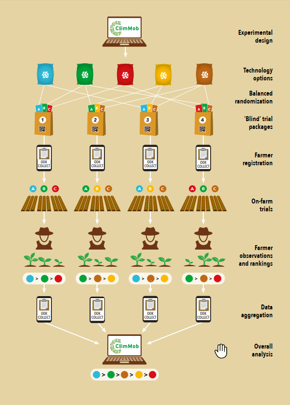

# Implementing a tricot experiment 

> Kauê de Sousa, Rachel Chase

Setting up experiments. For On-farm testing, best practices in planting and maintaining the plots. For consumer testing, best practices in handling the samples. Preparing the packages for distribution.

## Farmer recruitment (page 15 of short guide)

Any farmer who wishes to participate can get involved in a tricot experiment. Recruiting as many motivated farmers as possible is key to the success of the project. The local field agents should help to identify and recruit farmers in their communities. 

Hanging posters in agricultural shops, village halls or corner shops may also help to attract attention. You do not need to know the farmers before they participate. 

However, farmers should be:
• volunteers who are ready to commit time and effort to participation;
• farmers who enjoy experimenting and trying out new methods;
• both women and men, preferably at an even ratio.

A. Tricot is an iterative process 
This means that farmers ideally participate more than once in different experiments and across different seasons. When a tricot project starts and farmers participate for the first time, upfront project investments are required. The local field agents must be trained. Also, setting up and implementing the training workshops for participating farmers takes time. During their first cycle, farmers may have many questions and need assistance from local field agents. As the farmers will learn many things during each iteration of the process, and as they get to know only three randomly chosen technology options per cycle, we would encourage farmers to participate repeatedly. This way, first-time farmers can ask their more 
experienced farmer-colleagues when they have doubts, and the farmers get the chance to experiment with new sets of technology options with every cycle.

B. Local groups can carry out a joint trial
Carrying out a group or joint trial makes the learning process easier and participation more fun. Any existing group, like farmers’ committees, credit cooperatives, or a religious group can receive a trial package and participate together. In this case, a ‘host’ farm is needed, where the technology options can be tested. The host farmer will be the contact person for the local field agent, while all activities – such as planting and making the trial observations – can be performed jointly by the group. In the following season, individual group members may want to plant a trial for themselves, building on the experiences they gained in the group trial. To enhance the participation of women farmers, it can be useful to establish ‘women’s research groups’, who would be in charge of a number of tricot plots.

## Package distribution (page 17 of short guide)

The tricot process starts with a training and distribution workshop. Here, the farmers receive their trial packages and learn about the tricot methodology and data collection process.

### Organization and logistics
The training and distribution workshop should take place about four weeks before the start of the trial, so that farmers can adapt their own 
farm planning. It is most effective to invite a maximum of 20 farmers at a time to the workshop. Women and men should be invited in equal numbers, if possible.

Required workshop material and logistics: 
• A meeting place for about 20 persons
• Snacks
• Trial packages 

Every trial package should contain the following four elements:

1. A QR code generated for each package that will be used as a unique ID to track all the information collected during the trial. It is important to tell farmers to keep this code throughout the duration of the trial.

2. Three bags with equal quantities of the technology options (e.g. seeds, fertilizers) or instructions on how to apply the alternative technology options (e.g. tillage systems), according to the randomization that was generated by ClimMob.

3. An observation card where testers will note their on-farm observations

4. A brochure that explains the entire process to the farmer.

The randomization is done in such a way that it ensures that, in all places, the technology options will be made available with the same frequency. In technical jargon, the randomization is ‘balanced’. This avoids, for example, that one of the technology options did not occur in one of the villages in the trial. ‘Balancing’ the trial means that all technology options are spread across all the villages. For this to happen, however, it is crucial that each of the villages receive packages with consecutive numbers (1, 2, 3, 4, 5, etc.) and not random numbers (3, 11, 9, 23, 1, etc.). For example, the first village receives packages 1 to 9, the next village receives packages 10 to 23, etc. If this principle is followed, each of these villages will receive a balanced set. If it is not followed, there is a risk that one or more technology options will be completely absent in some of
the villages, so that you will never know if it is suitable there or not. 

### Teaching tricot

The project implementers, together with the local field agents, invite interested farmers to a central location. This can be a village meeting hall or an NGO office. They explain the tricot trial, its purpose, its benefits, and the responsibilities the farmers have. It is important to visualize what a tricot trial looks like, so farmers can see what is expected of them. If possible, you can develop a demonstration trial nearby beforehand. Otherwise, the trials can be visualized with a video (video 1: available at climmob.net). A small pictorial guide for farmers on tricot should also be handed out at the training workshop. Aformat for a foldable, guide (the size of a credit card) is available from climmob.net.

At the workshop, farmers are also trained on how to fill out the observation cards. Every farmer receives one observation card for the immediate exercise. It is important to fully explain the design of the card and go through filling out the card to allow the farmers to practice and gain familiarity with the process. Farmers will then be advised on how data will be collected, and whether a project implementer will be calling them or visiting them in person. 

### Registration of farmers

The ODK Collect app is used to register participating farmers. When the farmers receive their personal trial packages, they are registered by Field Agents using the project-specific registration form.‘Prepare farmer registration’ and will be available when the ODK Collect app is connected to the project on the ClimMob digital platform. The form should be downloaded to all field agents’ devices. 

At a minimum, these basic data are required: 
• Trial package QR code
• Name of the tester (participating farmer)

The trial package code uses an QR code generated by ClimMob as a unique package ID throughout the trial. The QR Code is generated once the technologies are defined and the randomization is set up. The project implementer prints the codes (available in the Downloads section) and pastes it into each package. Note: farmers should keep their package (QR) code for the duration of the project. 

More in-depth information regarding household and farm characteristics can be collected during registration using the pre-developed RHoMIS survey (available on the ClimMob website). 

## Trial execution

The farmers plant and manage the trials independently.Every farmer is responsible for his/her own plot.

• Carrying out an on-farm trial is simple. No special skills are required. Any farmer can participate.

• Farmers are farming experts. The participating farmers deserve full respect as generators of new knowledge. 

Through the training and distribution workshop, farmers were trained in tricot methodology, received their individual trial packages, saw a trial plot (on-site or through video), and received a brochure about tricot. Now they need to choose a part of their land on which to conduct their own trial. It is important to understand that the trials must represent regular farming practice for the results to be useful.

Two principles should be kept in mind:

1. The trial should resemble production conditions that reflect reality, not optimal production conditions. 

• To ensure this, the trial plot should be located right next to, or even within, the farmer’s regular production plot. Farmers should neither select the best nor the worst spot, but an average, representative location. 

• Also, each trial should be managed by the participating farmer in exactly the same way as they normally manage their crop (unless the technology under analysis is about crop management). For example: If the farmers usually intercrop with another crop, they may also do intercropping with the trial varieties. The regular plot and trial plots should be treated and maintained equally. Special attention to the trial plots, but also negligence, will distort the results. For example, if the farmers do not irrigate their production plot, they should not irrigate the trial plot either.

2. The trial should enable a fair comparison between the three options on each plot.

• The three technology options are applied next to each other, in separate sub-plots of the same size, and in the exact same way. In the case of varieties, each variety is planted in the same defined number and length of rows. For example: Six rows of five meters’ length each, or four rows of eight meters in length. 

• In the case of fertilizers or other input trials, amounts or combinations are applied as specified by the implementers.

• Technology option A is used to the left, B in the middle, C to the right. The borders between the technology options may be marked with sticks or a rope. The three technology options should never be mixed with each other. 

Apart from the small plot size, there is really nothing new or special about planting the trials. The farmers should be confident in using their own farming skills and implement the new technologies in the same way as they would normally conduct their work.

## Observation 

As the crop grows, the farmers observe the technologies and record their observations on the observation card. For many farmers, the questions asked in tricot pose a new way of looking at things.

Most farmers can tell which of the three technology options they generally like best. But it is not always easy to decide which one is the best for a specific evaluation criterion. 

The farmers observe and evaluate the technology options in their trials and focus on only one criterion at a time. The observations they make always follow the same structure: the ‘best’ and the ‘worst’ among the three trial technologies need to be identified. Farmers mark their choices on the appropriate page of the observation card. On the card, the question is asked in as few words as possible to make it easier for farmers. For example, instead of asking ‘Which of the three varieties has developed the best foliage?’ the observation card just asks: ‘Best foliage?’.

### Focus on one criterion at a time

Sometimes it is hard to acknowledge that a technology option was not successful for one criterion, but still performed best for another. For example, imagine a maize variety that was heavily affected by drought and disease and hardly produced yield, but has an excellent growth habit, with many tillers. It could look poor overall but would still be ‘best’ for ‘growth habit’. For best results, it is crucial to really focus on only one criterion at a time and ignore all others.

### Choose the right dates for the evaluation

Appropriate timing is important, and farmers should be told at which point in the process each criterion needs to be evaluated. For fertilizers or varieties, it is common to evaluate the trial in three stages: earlier-developing criteria (for example, foliage development), later-developing criteria (for example, disease resistance) and post-harvest criteria (for example, yield or market value). The project implementers should suggest the evaluation steps and dates to the farmers.

### Provide follow-up assistance

Many farmers have a busy life and their tricot trial will be one activity among many others. Through telephone calls, the project implementers or the local field agents may help the farmers to keep track of their evaluations and remind them of upcoming observation steps. The telephone calls will also help to clarify open questions and to let farmers know that their contribution is important and valuable. Within their own capacities, the local field agents may also support farmers directly in the evaluation at the plot. These follow-up calls can also be used to support the data compilation if farmers mention that they have already collected their data.

