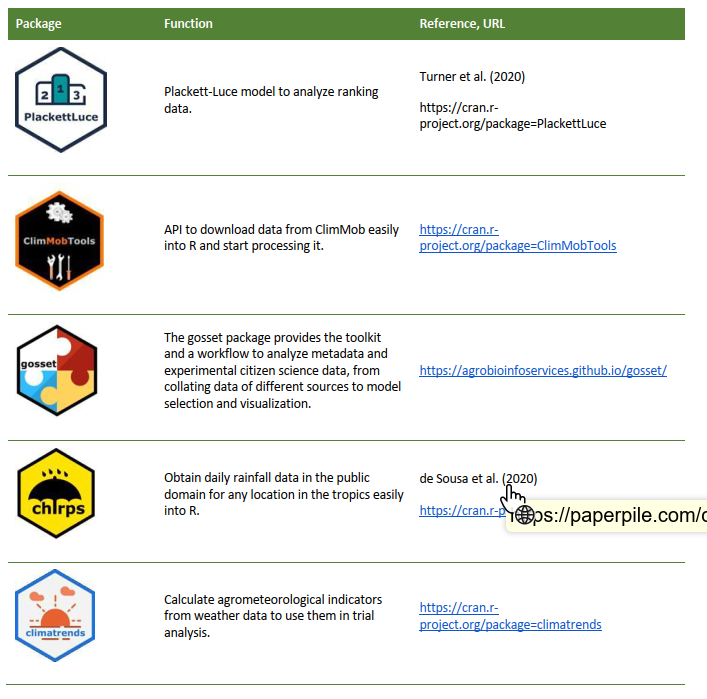

# Analysis of tricot data 

> Kauê de Sousa, Joost van Heerwaarden

Analytical framework. Overview of statistical models (e.g., Plackett-Luce, Bradley-Terry). Tools for analyzing ranking data. Visualization. Integration with other datasets (agroclimatic, soil, and socio-economic data). Case studies."

##Analysis page 24 in short guide

When all the data is uploaded to your ClimMob database, analysis can start.

The analysis will give you an automated report with useful results, such as:
• Description of the methodological approach applied
• A rating of how well each technology performed for each pre-defined criterion (see Step 2)
• Information on differing performances (if any) depending on explanatory variables (e.g. the highest yielding crop variety with or without irrigation; or the variety preferred by women, variety preferred by men)
• A rating of how all pre-defined characteristics were correlated with the overall performance. This is useful to assess which characteristic influenced the overall appreciation of the technologies tested. 

The analysis is conducted in six simple steps:

1. Select the project you will analyze.

2. Press the button ‘Select variables to analyze’ in the main menu of ClimMob. 

3. Select the explanatory variables you want to include. Explanatory variables can lead to a better understanding of different observations about the tested technologies, and to more useful results. For example, one crop variety may perform best under irrigation, but in drought conditions, a different variety may give best results.

4. Select the documents you want to generate. 
Two types of outputs are possible: 
• Analysis report 
This is for the implementing organization and the researchers. It is a report presenting all results: it tells you which technologies performed best for every tested criterion, and whether there are any differences due to explanatory variables, for example gender, age, irrigation.
• Infosheets 
This is a document that contains a personal information sheet for each participating farmer. These infosheets contain: 
• The names of their three specific tested technology options
• The farmer´s own answers
• The most recommended technology options for the farmer’s own farm. 

5. Press OK. 

Depending on the number of farmers, the analysis can take a long time. In some cases, it may take up to half an hour to generate all of the infosheets. You can obtain the infosheets and reports from the Downloads section.

## Data Analysis (RTB)

Tricot data consist of rankings, an unusual data type in the agricultural sciences, in spite of some experience with it in participatory research (Coe, 2002). As indicated in section 2, the tricot approach relies much on the Plackett-Luce model. The Plackett-Luce model also allows for the inclusion of covariates using recursive partitioning, which uses binary splits (Strobl, Wickelmaier and Zeileis, 2011). At the moment, the Plackett-Luce package is being expanded to include Plackett-Luce regression, which uses linear covariates (Yildiz et al., 2020). 

Van Etten et al., (2019) showed how the Plackett-Luce model can be used in combination with seasonal climate data and cross-validations to produce robust, locally-specific variety recommendations. Tricot data analysis has recently expanded into two directions. 

Firstly, Brown et al., (2020) have described how the Plackett-Luce model can be used to synthesize trial data from across different trials. Ongoing work is doing this with tricot trials (and other trials, after converting absolute values to ranks to deal with highly heterogeneous data). This is a promising new direction, as it will show in the future that working with a standardized approach like tricot and sharing data openly has strong benefits for science in general and generates recognition for individual scientists who decide to publish their data. Also, it may stimulate data publication from trials that are not worth a peer-reviewed journal article on their own but gain value after being combined with data from other trials.  

In a forthcoming paper, de Sousa et al. (2020) take the Plackett-Luce model in another direction, by adding genomic relatedness data to the model (as a covariance matrix). This increased the predictivity of the model in an important measure, showing that it may be feasible and relevant to use relatedness data to allow for more diverse sets of materials to be tested by farmers. This may require important changes in breeding approaches but it provides an interesting prospect. 

The new Plackett-Luce regression approach will also allow the use of variety traits as covariates (Yildiz et al., 2020). This opens interesting possibilities to analyze the relative influence of known trait values on on-farm performance. It will also possibly provide avenues to link tricot results with trait prioritization exercises, discussed in section 4 above. 

Data analysis has also been increasingly supported by implementing the existing code, which was generated to a large degree for the analyses presented in (van Etten et al., 2019), into R packages. The R packages that have been generated as a result from this research are listed in Table 2. 

