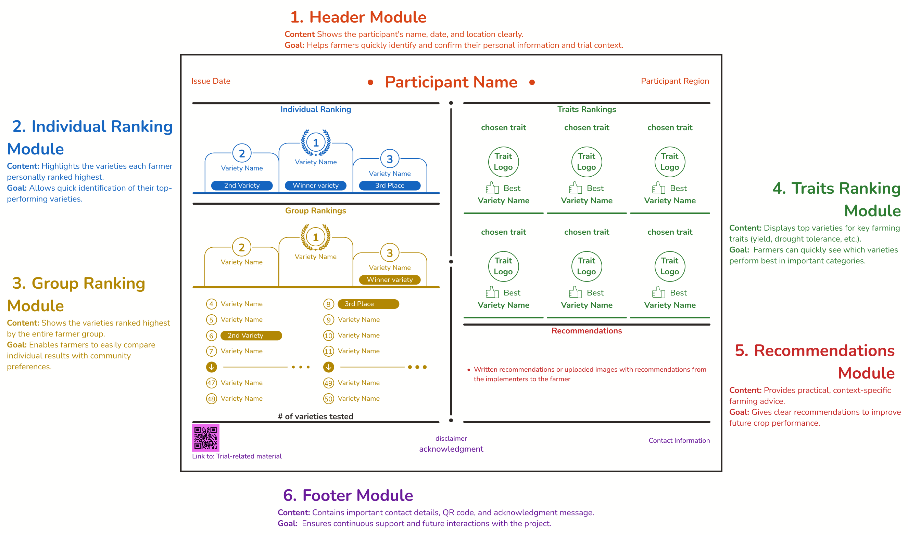
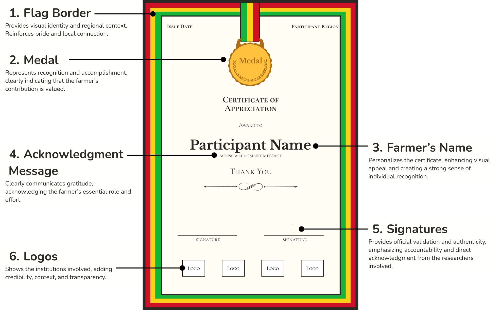

# Trial feedback and evaluation

> Anna Muller, Juan Manual Londono

## Feedback to farmers

You have concluded your trial on ClimMob. Now the farmer-researchers are eager to know the results of their trials. All farmers are invited to a final workshop to receive and discuss the results. 

Farmers are the data producers of this citizen science approach and thus discussing the outcome of the trials is a crucial part of the tricot vision for partnership on the same level. Also, farmers have had different experiences with their trials, so reciprocal sharing of these experiences with other farmers is an important part of the learning process. Plan at least half a day for each feedback workshop.

We recommend that the workshop consists of four parts:
1.	The farmers receive their personal infosheets with the names of the technologies that they tested and which technology they preferred. They are given time to discuss the results with other farmers and implementers. It is recommended to form small groups for this activity (of about 5-7 people), including a facilitator (a field agent or experienced farmer). Groups can present their conclusions in a plenary session.

2.	The  project implementers or the local field agents present the overall results of the technology evaluation using the farmer feedback sheet. Farmers learn which of these technologies performed best under which conditions. They get acknowledged for their work with the tricot diploma (see below).

3.	Facilitators can prepare related information for farmers according to their expressed needs: farmer might be interested in agronomic advice for the crop they produce, access to see to the tested varieties, or other information related to the tested varieties, e.g. market demand, market access, seed storage or seed selection. 

4.	Inform farmers about next steps in your engagement: What will the data be used for? How can farmers reach the project implementers? Are more trials planned? What will happen now in the technology development process? Answers to these questions treat farmers as meaningful partners on the same level.

These points should be considered by the field agents:
• Discussion among the farmers is important: everyone can learn from each other.
• It is crucial to make it clear that there is no single best technology option. In fact, optimal technology options can differ across farms and farmers .
• Field agents should also annotate feedback provided by the farmers on their experience with the trials and the project in general.

### Feedback materials

The farmer feedback sheet – the main trial results
This sheet available here was designed to present individual and group trial results to farmers in an easily understandable way. It is automatically generated by ClimMob when you request the analysis of your trial results. The sheet contains basic information about which varieties performed best for the farmer and the group. Print this sheet for every farmer in your trial. People that cannot attend the feedback session may still receive this via their neighbors .

   
The farmer diploma – an acknowledgement of the farmers’ contribution
This diploma was designed to stress the importance of the farmers' contribution to the tricot trial. It is an acknowledgement of their role in the process. You can add the logo of your organization to the certificate. Print this for every farmer and sign. 

### How to prepare feedback sessions
•	Budget : Plan resources (team time and money) for this final workshop from the start. Plan your team’s time to visit all communities or regions holding trial result workshops. Plan for your team’s time to debrief after the workshops  and document learnings to integrate them in the planning of next trials.
•	Group sizes: As with the training and distribution workshop, in most cases farmers should be limited to around 20-25 per event, in a central location accessible to all.
•	Materials – depends highly on implementation of the sheet & diploma. We recommend :

## Trial evaluation 

The first tricot cycle has finished. What can be improved?

Countries, crops, farming systems, and people are diverse, so every tricot project is different. This booklet can only be a guide to assist you in designing your own local experiment. Tricot is an iterative process and the last step in a project cycle is the evaluation of the project for further improvement.

Listening to the farmers’ experiences is most important. It is crucial that farmers perceive tricot as both simple and beneficial. You should try to identify possible improvements in managing and executing the trials. At the feedback workshop, farmers can express their experiences, recommendations and complaints about the process. Moreover, the local field agents can provide project implementers with many valuable comments and recommendations, since they have constantly been in touch with the farmers and in some cases have followed the trials in person on site.

After every project cycle, the project implementers, researchers, and local field agents should discuss how to improve the process. Including more farmers with every project cycle should be a constant objective in tricot, so that more households can benefit from the research.

Also, with the results of every cycle, you may identify one or two technology options that were not well accepted by the farmers, or that did not work well in your region. For the next cycle, you can discard those technology options ranked lowest by farmers and replace them with new ones. This way, there is ‘refreshed’ input to the research system, and the farmers’ chances of discovering a suitable technology option for the conditions of their farm remain high.

### Indicators of success 

The success of your tricot trial can be measured. You can evaluate four indicators in ClimMob, which will give you an idea about the individual trials’ impact, and the project’s overall success.

1.	The rate of completed trials: counts the trials that were fully completed, as well as the trials where data was missing. You can evaluate whether the loss of information is due to natural causes (e.g. drought that made it impossible to evaluate certain criteria on farm) or to the farmer’s management of the trial (e.g. a mistake with the package code (QR code), lack of interest in finishing the observations). This way, important knowledge about the specific difficulties can be generated, which will help you find strategies to avoid them being repeated.

2.	Farmers’ gender balance: it is important to recognize the gender ratio in the cultivation of a particular crop and strive to achieve the same ratio in the trials. For example, maize is considered a “cash crop” in some countries and therefore tend to be male dominated, while other crops like millet tend to be considered womens’ crops. The goal of tricot trials is to get a proportional participation compared to the population growing the specific crop and bring evidence on the effects of these dynamics.

3.	Returning farmers: The percentage of farmers who participate again after the first cycle is a clear indicator of the farmers’ motivation. If many of the farmers do not want to participate a second time, something about the tricot process design may need to be changed.

4.	Changes in the technology choice: On the observation card, the farmers write whether they will continue using any of the new technology options from their tricot trial. If they choose to use at least one of the three technology options, this shows the impact of the trials. If no or very few farmers want to continue using the newly introduced technology options, then the initial pool of technology options may need to be reconsidered.
