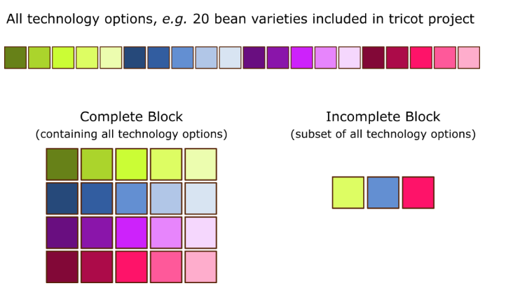
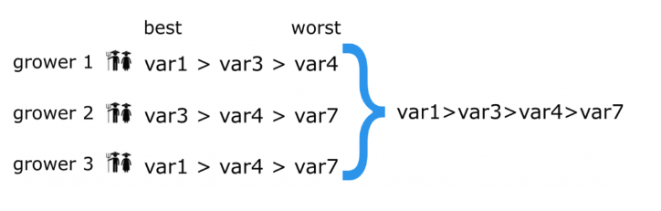

# Glossary

**Administrator** is the person or organization who coordinates the tricot project. It’s the project manager. The administrator could be a scientist working at a research institute, or at an NGO, governmental extension service, etc.
If the administrator is not a scientist, she or he might collaborate with scientists or a research institute to develop the tricot project, and obtain the tested technologies, such as seeds or fertilizer.
The tasks of the administrator include:
*	Designing the tricot project using ClimMob software
*	Recruiting field agents and participants
*	Training field agents
*	Preparing trial packages
*	Organizing initial workshops
*	Keeping track of growers’ data collection
*	Analyzing data using the ClimMob software
* Communicating final results to participants in final workshops (together with field agents)

**Balancing a trial**
‘Balancing’ the trial means that all technology options are spread across all the participating villages. Each village will receive packages with 
consecutive numbers (1, 2, 3, 4, 5, etc.) and not random numbers (3, 11, 9, 23, 1, etc.). If this principle is followed, each of these villages will receive a balanced set and all of the technology options will be tested and evaluated.

**ClimMob**
Online software for the design and management of any tricot experiment (www.climmob.net). The database of all tricot projects is stored here. Project implementers also use ClimMob for the analysis of results and the generation of information outputs at the end of the project.

**ClimMobTools** is an open-source statistics toolkit available on the R platform. It enables administrators to further explore and analyze their tricot data. The ‘ClimMobTools’ R package supports more sophisticated data analysis than what is offered through the easy-to-handle ClimMob online software.
R software (free): https://cran.r-project.org/
ClimMobTools: https://cran.r-project.org/web/packages/ClimMobTools/index.html

**Evaluation criteria**
The 5 to 10 criteria that will be evaluated within the tricot experiment. These criteria should be chosen in consultation with all stakeholders. 
For example: Plant height, disease resistance, yield, and others.

**Explanatory variables**
For on farm trials, information about meteorology and agronomic management of the trials serves to improve the analysis. The explanatory variables refine the results and help to identify the most suitable variety for the local conditions of every farm. Examples: Use of irrigation, use of fertilization, season was rainier or drier than usual, etc.

**Farmers / participating farmers**
Women and men who participate in a tricot experiment by managing their own tricot trial and carrying out the observations, marking the observations on the observation card at the appropriate dates, and eventually reporting the observations to the local field agents. Their recruitment should involve considerations of gender, age and other demographic factors, as well as their task related to the technology under evaluation. In some tricot trials, non-farmers participate, based on their role in food processing, trading, retailing or consumption.

**Field agent** is the extension worker, linking the implementer and the participants. A tricot project might employ 20 to 30 field agents. Each field agent can cover a different geographical region and can coordinate 10 to 20 participants. Field agents are vital to a tricot project, as they allow many small trials to take place in different regions at the same time.
Field agents get trained by the implementer, and in turn pass their knowledge on to the participants. The implementer can also be a field agent. Likewise, a field agent can also participate in the tricot project as an observer.
*The tasks of field agents include:
*	Staying in personal contact with participants
*	Assisting participants with trial cultivation and data collection
*	Collecting participants’ observations at the end of the trial through personal visits or telephone calls
*	Passing on participant data to the implementer, using the ODK Collect app

**Implementing organization/ project implementers**
The organization that is in charge of carrying out and monitoring the project. It can be an NGO, a government service, or a research program, among other options. Implementers have the major responsibilities in the project, for example:
* Training the field agents and participants
* Distributing the trial packages
* Carrying out the data analysis once all data is collected and compiled
* Feeding back the information to the participants via the field agents.

**Incomplete block design**
Incomplete block design refers to an experimental setup in which not all treatments occur in one block. In the case of tricot, this means that not all technology options (= treatments) occur in each individual trial (=block). Instead, each participant cultivates or tests just three technology options in her/his trial (for example, three randomly assigned bean varieties), instead of cultivating all technology options included in the tricot project (which could be up to 20 bean varieties). Because many participants each cultivate a trial with a subset of three different technology options, all these individual trials – taken together – cover the testing of all technology options.

**Infosheet**
Personalized information output for every participant. It is generated automatically using ClimMob and includes:
* Names of the three technology options that the participant received and tested
* Names of the most recommended option for their farm (in the case of on-farm trials)
* Information about where to obtain more material of the preferred technology option (if applicable).

**ODK Collect**
ODK stands for ‘Open Data Kit’. ODK Collect is a free app for Android devices that is used to collect and compile data. It completely replaces the need for paper forms, for example during a survey.

In a tricot project, the field agents use this app on a mobile devices (smartphone or tablet) to collect the field observation data from participants. Each participant has written down their observations on their own observation card, and ODK Collect offers a simple way to digitize and compile the data from many growers.

The field agents do not need to be connected to the internet when entering data into ODK Collect, for example, when they are out in the field, visiting participants. When a participant observations are entered, ODK Collect will first store the data locally on the field agents’ mobile device. The field agents can upload the data to ClimMob at later points in time, whenever the device can connect to the internet again. ODK Collect then uploads the individual data sets to the ClimMob online software.

The app can be downloaded for free from the Google Play Store. ** Note that the app is available for Android only, not for iOS.**

**Observation card**
Observation cards are used by the participants to record their field observations during different stages of the tricot trial. These paper cards are distributed by the field agents at the initial training event. Over the course of the trial period, the growers fill them out, using a pen.

Observation cards get designed by the project administrator, adapting a template that is available on ClimMob. Which observations participants need to make, and at what points in time – the observation card includes this information, to help participants collect their data alone. Observation cards require the observations to be entered as comparison data (ranking).

**On-farm trial** On-farm trails are tricot experiments conducted on the fields of participants. Participants in this case are farmers, and their role is to test throughout the growing season the three different technologies in their fields.

**Plackett-Luce model**
In a tricot project, ranking data is collected on all participants (either farmers or consumers) with each one of them contributing one ‘partial ranking’. The ClimMob software uses the statistical Plackett-Luce model to combine all these partial rankings into a full picture.

The image below visualizes an example. Here, three growers each rank their individual set of three technology options (for example, crop varieties). Participant 1, for example, reported that var1 was the best technology option, while var4 was the worst, and var3 took a middle position.

The partial rankings from all participants are then combined, giving the overall ranking. When there are disagreements (for example, some participants find that var3 > var4, but others report that var4 > var3), the Plackett-Luce model determines the most likely overall 

**Randomization**
The balanced creation of sets of three varieties from the full pool of varieties. The randomization is generated by the ClimMob software and is required to prepare the trial packages.

**Ranking**
Ranking is a way of describing the relationship between two items, for example, one being ‘bigger than’ the other. Ranking data is common, for example, in sports (‘Claire ran faster than Anna’), or in consumer studies (‘Consumers like apples better than pears, and pears better than strawberries’).

In tricot project, participants observe their technology options and rank these options by different aspects of their performance. Using ranking as a way to collect field observations in on-farm trials has proven successful in a number of studies. There are multiple advantages in asking participants to rank, rather than take exact measurements or give subjective ratings:

Ranking avoids a drift in the point of reference during the evaluation process, it avoids different interpretations of the scoring scale between participants, and ranking is easy to explain and understand. A disadvantage of ranking is that it does not give an absolute zero, or an absolute scale.

In a race, two athletes might cross the finish line at the exact same time. In a tricot trial, a participant might observe two different bean varieties without noticing any difference in growth. However, the observation cards only allow field observations to be entered as ranks – ties are not possible. Even though it might be tough to spot the difference – we encourage participants to take another look. Surely, there is some small difference.

ClimMob analyzes ranking data using the statistical Plackett-Luce model.

**Researchers**
Experts studying or using the agricultural technology under evaluation. They select the technology options to be included in the project and supply experimental material for each technology option to the implementing organization.

**Sequentially balanced randomization**
‘Random’ means that there is no obvious pattern or predictability in the way items are ordered. Simple randomization is the process of putting anything in a random order.

In a tricot experiment, growers receive trial packages that contain a random sub-set of three technology options. For example, if the tricot focus technology is ‘bean varieties’, every participating grower receives a set of three bean varieties, which are randomly picked from the total pool of bean varieties included in the project. Experience shows that a small share of growers tends to drop out of a tricot project, for different reasons. This is not a problem at the level of the entire project. At the local level, however, this can lead to an imbalance. If technology options are distributed by simple randomization only, some technology options can be rare or absent in a certain community.

To address this issue, the tricot approach uses the ClimMob online software to assign technology options to participating growers using an advanced form of randomization: sequentially balanced randomization. This means that trial packages contain a balanced frequency of each technology option. For example, if we distribute packages 1–10 in the first local community, 11–30 in the second community and 31–40 in the third community, each individual variety will occur with nearly equal frequency within each community. If growers in the first community take only 9 trial packages instead of 10, distribution in the second community can simply start with trial package 10.

**Technology** Using the tricot approach, many agricultural technologies can be tested and innovated. For example: Crop varieties, Fertilizer regimes, Irrigation systems, Pest management strategies, soil management strategies, etc.
Every tricot project focuses on one technology (for example, ‘fertilizer composition’), but tests a number of different technology options (fertilizer composition 1, fertilizer composition 2, etc.). In the past, for example, tricot has often been used to innovate a certain crop (technology) by testing new crop varieties (technology options). Experimental design terminology would refer to technology as ‘treatment’, and to technology options as ‘levels’. In the context of tricot, we chose to use ‘technology’ and ‘technology options’ for easier understanding.

**Technology options**
Each tricot experiment focuses on one agricultural technology (for example, ‘fertilizer composition’), but tests several technology options 
(fertilizer composition X, fertilizer composition Y, etc.). These technology options should in principle be suitable to local conditions and have the potential to be adopted by some of the farmers.  The researchers select the technology options, and they are recommended to begin a first experiment made up of between 8 to 12 options.

**Trial package**
A bag given to every participant at the initial workshop. The large bag is marked with a number and a QR code. It contains: (i) three small bags containing material of the different technology options ( marked with ‘A’, ‘B’, and ‘C’); (ii) an observation card; and (iii) an explanatory brochure about the tricot process.

**Trial plot**
For on-farm trials, a small area within or at the margin of the farmer’s production plot, with representative soil conditions. It is divided into three equal parts, for the testing of the three technology options assigned to the farmer.

**Tricot**
The word ‘tricot’ is derived from three words: Triadic comparison of technology options. ‘Triadic’ refers to the sets of three technology options that are compared in each trial. In technical jargon, three things define tricot: (1) the use of incomplete blocks of three items (to make the threshold of participation low in terms of farm size and to make it cognitively manageable), (2) the use of ranking as the main way to report observations (to facilitate digital data collection and to make it possible to cultivate a tricot plot with very little training), and (3) the limited control of experimental conditions (following usual technology use practice to maximize external validity).

**Tricot trial**
Test of different technological options, in sets of three, each observed and ranked by a participant. For an on-farm trial, the options are grown and observed in a small designated area of her/his own farm.

**Tricot Experiment**
A tricot experiment (or tricot project) refers to the whole process of putting the tricot approach into action. That is, engaging a large number of participants in testing a range of technology options in random sub-sets of three technology option per participant.

A tricot experiment, or tricot project consists of many small tricot trials.

