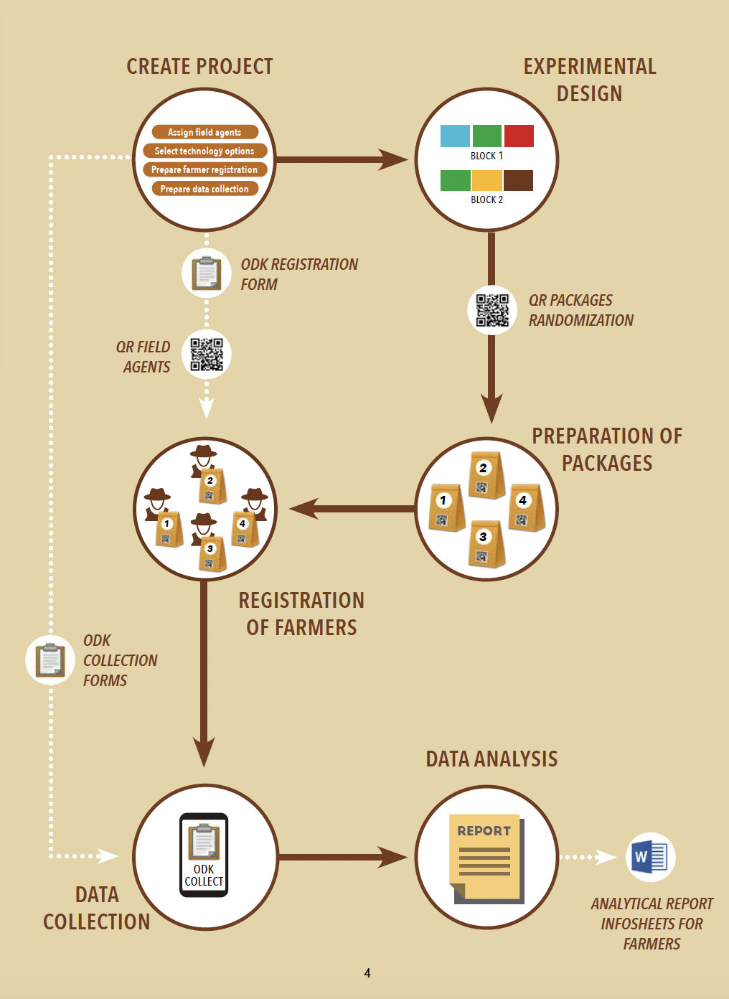

# The 10 steps of a Tricot project

This guide provides a short overview of each of the 10 steps needed to develop and implement a tricot project.

## Step 1: Preparation
Researchers define a set of comparable technology options to test. For example, they decide to compare crop varieties with each other, or different fertilizer types, or irrigation technologies. They will provide the necessary materials (inputs or other) to project implementers (organizations that will reach farmers). Typically, about 8-12 technology options (comparable items) are included in the trial to be tested.

## Step 2: Design
The implementing organization uses the ClimMob (climmob.net) free online software to design the project. This digital platform has been specifically created to manage tricot projects, from designing the experiment to data collection and analysis. The use of the digital platform streamlines the process. ClimMob offers the following benefits:
1. ClimMob helps to avoid mistakes by introducing QR codes and electronic forms;
2. ClimMob provides a dashboard to monitor progress;
3. ClimMob reduces or eliminates the effort spent on digitalizing data collected on paper;
4. ClimMob creates automatic reports with analytical results, avoiding the usual lengthy process of data cleaning and analysis;
5. ClimMob provides clean, formatted data that can be easily downloaded for further analysis with existing tools, for example, combining with weather data.
The tricot project will only work well if ClimMob is used from the very start and implementers are trained in its use. After designing the project, the implementers prepare trial packages, which include experimental quantities of three randomly selected technology options generated by the ClimMob platform.

## Step 3: Recruitment
The implementers recruit dedicated farmers interested in improving their farming through the use of new technologies.

## Step 4: Distribution
Farmers are trained in the tricot approach and on how to collect data. Each farmer receives a trial package of three technologies to be tested.

## Step 5: Execution
Farmers use their trial packages to apply the new technology options separately, on small plots next to each other, in a mini-trial on their own farm. To avoid any bias, they are not aware of the names of the crop varieties or other technology options they are testing. These are revealed to them only after the data has been collected.

## Step 6: Observation
Every farmer is responsible for their own trial and makes various easy observations about their three options over the course of the season. For example: Which variety had the highest or the lowest yield? The farmers record these observations on an observation card.

## Step 7: Compilation
The local designated field agents collect and compile the observation data from the tricot farmers, either in person or by phone. They record the information digitally and send them on to the implementing organization. For this, they can use the free ‘ODK Collect’ smartphone app, which is connected to the ClimMob software.

## Step 8: Analysis
The implementers compile and analyze the data from the trials, using the ClimMob online software, to identify which technology options showed the best performance and under which conditions.

## Step 9: Feedback
The implementers provide feedback to every participating farmer: the names of their three technology options, which options were most suited to their farm (out of the three options tried by them and out of all the options tried by farmers throughout the project), and where to obtain them.

## Step 10: Evaluation
Tricot is an iterative process: after every project cycle, researchers, implementers and farmers collaboratively evaluate how the process may be improved in the next cycle.
