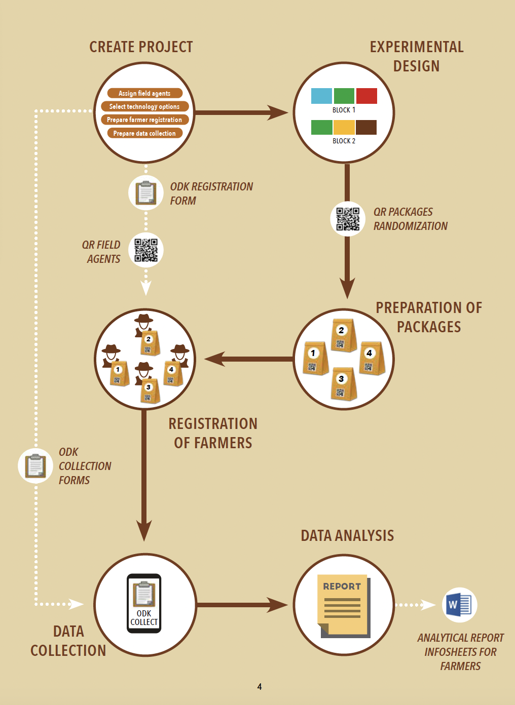

# Les 10 étapes d'une expérimentation tricot

> Rachel Chase

Ce guide offre un aperçu succinct de chacune des 10 étapes nécessaires pour développer et mettre en œuvre un projet tricot.

## Étape 1 : Préparation
Les chercheurs définissent un ensemble d'options technologiques comparables à tester. Par exemple, ils peuvent décider de comparer des variétés de cultures, différents types d'engrais ou des technologies d'irrigation. Ils fourniront les matériaux nécessaires (intrants ou autres) aux organisations responsables de la mise en œuvre du projet (celles qui atteindront les agriculteurs). En général, environ 8 à 12 options technologiques (éléments comparables) sont incluses dans l'essai.

## Étape 2 : Conception
L'organisation de mise en œuvre utilise ClimMob (climmob.net), un logiciel en ligne gratuit, pour concevoir le projet. Cette plateforme numérique a été spécifiquement créée pour gérer les projets tricot, de la conception de l'expérience à la collecte et l'analyse des données. L'utilisation de cette plateforme simplifie le processus. ClimMob offre les avantages suivants :
1. ClimMob aide à éviter les erreurs grâce à l'utilisation de codes QR et de formulaires électroniques;
2. ClimMob fournit un tableau de bord pour surveiller les progrès;
3. ClimMob réduit ou élimine l'effort nécessaire pour numériser les données collectées sur papier;
4. ClimMob génère des rapports automatiques avec des résultats analytiques, évitant ainsi le processus habituel et long de nettoyage et d'analyse des données;
5. ClimMob produit des données propres et formatées qui peuvent être facilement téléchargées pour des analyses supplémentaires avec des outils existants, par exemple en les combinant avec des données météorologiques.

Le projet tricot ne fonctionnera bien que si ClimMob est utilisé dès le début et que les acteurs de mise en œuvre sont formés à son utilisation. Après la conception du projet, les acteurs préparent les kits d'essai, qui incluent des quantités expérimentales de trois options technologiques sélectionnées au hasard et générées par la plateforme ClimMob.

## Étape 3 : Recrutement
Les acteurs recrutent des agriculteurs motivés, intéressés à améliorer leur exploitation grâce à l'utilisation de nouvelles technologies.

## Étape 4 : Distribution
Les agriculteurs sont formés à l'approche tricot et à la collecte des données. Chaque agriculteur reçoit un kit d'essai contenant trois technologies à tester.

## Étape 5 : Exécution
Les agriculteurs utilisent leurs kits d'essai pour appliquer les nouvelles options technologiques séparément, sur de petites parcelles côte à côte, dans un mini-essai sur leur propre exploitation. Pour éviter tout biais, ils ne connaissent pas les noms des variétés de cultures ou des autres options technologiques qu'ils testent. Ces noms leur sont révélés uniquement après la collecte des données.

## Étape 6 : Observation
Chaque agriculteur est responsable de son propre essai et effectue diverses observations simples sur ses trois options tout au long de la saison. Par exemple : Quelle variété a donné le rendement le plus élevé ou le plus faible ? Les agriculteurs enregistrent ces observations sur une carte d'observation.

## Étape 7 : Compilation
Les agents de terrain désignés collectent et compilent les données d'observation des agriculteurs tricot, soit en personne, soit par téléphone. Ils enregistrent les informations numériquement et les transmettent à l'organisation de mise en œuvre. Pour cela, ils peuvent utiliser l'application gratuite pour smartphone «ODK Collect», connectée au logiciel ClimMob.

## Étape 8 : Analyse
Les acteurs compilent et analysent les données des essais, en utilisant le logiciel en ligne ClimMob, pour identifier quelles options technologiques ont montré les meilleures performances et dans quelles conditions.

## Étape 9 : Retour d'information
Les acteurs fournissent un retour d'information à chaque agriculteur participant : les noms de leurs trois options technologiques, celles qui étaient les mieux adaptées à leur exploitation (parmi les trois options testées par eux et parmi toutes les options testées par les agriculteurs à travers le projet), et où se les procurer.

## Étape 10 : Évaluation
Tricot est un processus itératif: après chaque cycle de projet, les chercheurs, les acteurs de mise en œuvre et les agriculteurs évaluent ensemble comment le processus peut être amélioré dans le cycle suivant.
